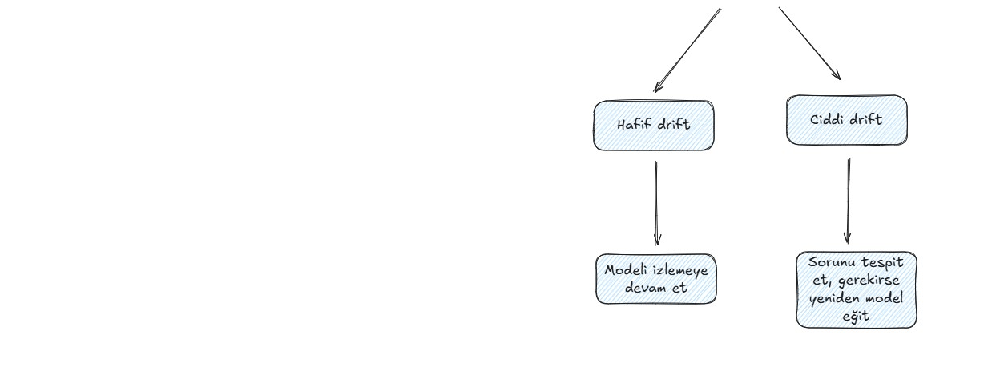

# Oturum 3: Proje Yapıları ve Veri Manipülasyonu

**Tarih:** 10 Mart 2025 | **Hafta 2** | **Eğitmen:** [Enes Fehmi Manan](https://www.linkedin.com/in/enesfehmimanan/)

---

## Konular

**Veri Bilimi Yaşam Döngüsü & Problem Tanımı**
- Business probleminden ML problemine geçiş: ne zaman ML gerekir, ne zaman basit kurallar yeterlidir?
- Target tanımı ve oluşturulması, train-test periyot belirlenmesi
- Veritabanından feature seçimi: domain bilgisi ve regülasyonların rolü

**Python Proje Yapısı**
- Virtual environment, `requirements.txt`, klasör organizasyonu
- Production-ready proje iskeletinin kurulması

**EDA — Exploratory Data Analysis**
- Veriye ilk bakış: shape, veri tipleri, missing value oranları
- Descriptive statistics ve varyasyon katsayısı
- Sürekli ve kategorik değişken dağılımları (Matplotlib & Seaborn)
- Aykırı değer tespiti
- Korelasyon analizi

**Veri Hazırlama**
- Null değer yönetimi, tip dönüşümleri
- Feature selection

**Baseline Model**
- Lojistik regresyon ile ilk model kurulumu
- Performans metrikleri (AUC-ROC vb.)

---

## Kaynaklar

- [data_prp_baseline.ipynb](data_prp_baseline.ipynb) — Oturum eğitim notebook'u. Home Credit Default Risk veri seti üzerinden problem tanımı, EDA, veri hazırlama ve lojistik regresyon baseline modeli adım adım işlenmektedir.

- [credit-risk-model](https://github.com/enesmanan/credit-risk-model) — Oturumda işlenen proje yapısı, data cleaning ve EDA adımlarının uygulandığı ana eğitim reposu. ML tabanlı kredi risk tahmin sistemi üzerinden gerçek bir data science workflow'u incelenmektedir.

- [GitArch](https://github.com/enesmanan/GitArch) — Herhangi bir GitHub reposundan otomatik olarak özet, mimari diyagram ve kod analizi içeren interaktif raporlar üreten araç. Proje yapısını anlamlandırmak için kullanılabilir.

- [Machine Learning Engineering — Andriy Burkov (PDF)](https://soclibrary.futa.edu.ng/books/Machine%20Learning%20Engineering%20(Andriy%20Burkov)%20(Z-Library).pdf) — *The Hundred-Page Machine Learning Book* yazarından kapsamlı bir ML engineering kitabı. Data pipeline'ları, model geliştirme ve production deployment süreçlerini ele almaktadır.

## Veri Bilimi Yaşam Döngüsü

